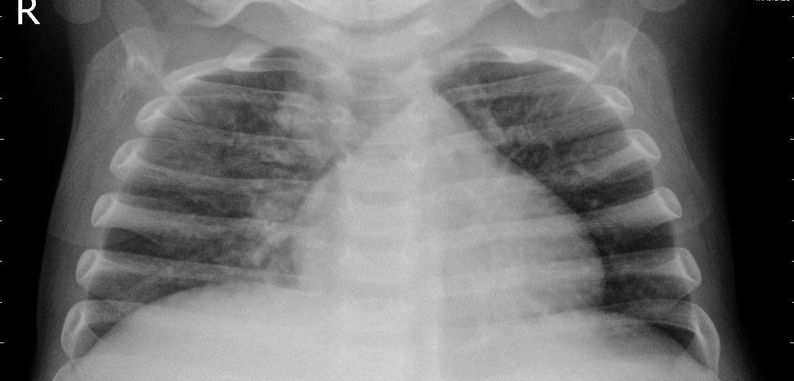

# 🫁 Pneumonia Detection from Chest X-Rays using CNN & Transfer Learning

This project uses deep learning models to detect pneumonia from chest X-ray images. It includes both a custom Convolutional Neural Network (CNN) and a pre-trained MobileNetV2 model with transfer learning. Grad-CAM is applied for visual explanations.

---

## 📂 Dataset

- **Source:** [Chest X-Ray Images (Pneumonia) dataset](https://www.kaggle.com/datasets/paultimothymooney/chest-xray-pneumonia)

## 🧠 Model Architectures

### 🔹 1. Custom CNN
- 3 Convolution + MaxPooling layers
- Dense layers with dropout
- Activation: ReLU + Sigmoid
- Output: Binary Classification (`NORMAL`, `PNEUMONIA`)

### 🔹 2. MobileNetV2 (Transfer Learning)
- Pre-trained on ImageNet
- Top layers removed
- Custom head added:
- Global Average Pooling
- Dropout
- Dense output layer

---

## 🏋️‍♀️ Training

- **Image Size:** 224x224
- **Augmentation:** Zoom, Shear, Horizontal Flip (for training)
- **Optimizer:** Adam
- **Loss:** Binary Crossentropy
- **Epochs:** 25
- **Batch Size:** 32

---

## 📈 Results & Evaluation

| Metric        | CNN Model | MobileNetV2 |
|---------------|-----------|-------------|
| Test Accuracy | 82%       | 87%         |
| Recall (PNEU) | 99%       | 98%         |
| Precision (NORM) | 98%    | 96%         |

> 📌 Both models perform well, with MobileNetV2 showing slightly better generalization and fewer false positives.

---

## 🔍 Grad-CAM Visualizations

Grad-CAM (Gradient-weighted Class Activation Mapping) is used to highlight regions of X-ray images that influenced the model's decision.

| Example | Heatmap |
|--------|---------|
|  |  |

🟥 **Red** regions = high importance  
🟦 **Blue** regions = low importance

---

## 📊 Observations

- **CNN Model** performed well but overfitted slightly.
- **MobileNetV2** generalized better and required fewer resources.
- Grad-CAM helped verify that the model focuses on lungs, supporting interpretability.

---

## ❗ Challenges & Lessons Learned

- Class imbalance impacted early CNN training.
- Transfer learning improved results with fewer epochs.
- Grad-CAM debugging required careful layer naming.
- Dataset preprocessing (resizing, normalization) was critical for stability.

---

## 🚀 How to Run

1. Clone this repo:
 ```bash
 git clone https://github.com/miralhsn/Pneumonia-Detection-from-Chest-X-Rays
 cd Pneumonia-Detection-from-Chest-X-Rays
```

2. Install dependencies
3. Run training or inference via Colab or your local Jupyter setup
