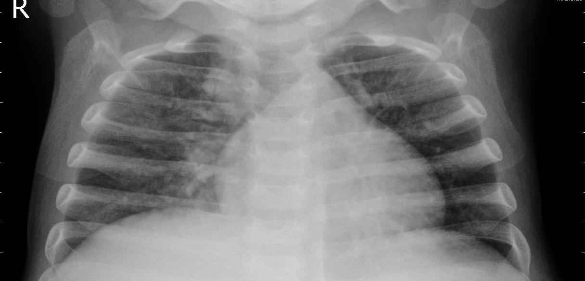
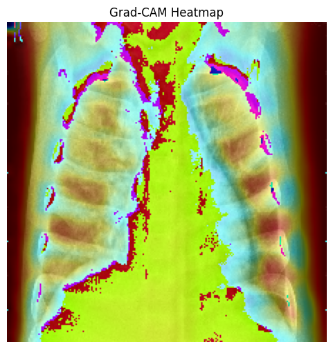

<h1 align="center">🫁 Pneumonia Detection System</h1>

<h3 align="center">
Deep Learning-Based Chest X-Ray Classification using CNN & Transfer Learning
</h3>

  <a href="https://pneumonia-detection-from-chest-x-rays.streamlit.app/">
    🚀 Live Demo
  </a>

  
  
  

---

## 🧠 Overview

This project is a **deep learning-based medical imaging system** that detects pneumonia from chest X-rays.

It demonstrates an end-to-end AI pipeline including:
- Image preprocessing
- Deep learning classification
- Transfer learning optimization
- Real-time web deployment

---

## 🚀 Live Demo

👉 https://pneumonia-detection-from-chest-x-rays.streamlit.app/

Upload a chest X-ray image and receive instant AI-based diagnosis.

---

## 🏗️ Model Architectures

### 🔹 Custom CNN
- 3 Convolution + MaxPooling layers  
- Fully connected dense layers  
- Dropout regularization  
- Binary classification: NORMAL / PNEUMONIA  

### 🔹 MobileNetV2 (Transfer Learning)
- Pre-trained on ImageNet  
- Lightweight architecture  
- Fine-tuned for medical imaging  
- Improved generalization performance  

---

## 📊 Model Performance

| Model | Accuracy | Recall (PNEUMONIA) | Notes |
|------|---------|---------------------|------|
| CNN | 82% | 99% | Overfitting observed |
| MobileNetV2 | 87% | 98% | Best generalization |

---

## 🔍 Explainability (Grad-CAM)

Grad-CAM is used to visualize **model decision regions**.

- 🔴 Red → High importance (lung infection regions)  
- 🔵 Blue → Low importance  

This ensures **interpretability in medical AI systems**, which is critical for real-world usage.

---

## 🫁 Sample Predictions

  
  

---

## ⚙️ Tech Stack

- Python  
- TensorFlow / Keras  
- OpenCV  
- NumPy  
- Matplotlib  
- Streamlit (Deployment)

---

## 📌 Key Insights

- Transfer learning significantly improves generalization  
- CNN baseline showed overfitting on small dataset  
- Proper preprocessing is critical for medical imaging  
- Explainability improves trust in predictions  

---

## ⚠️ Challenges

- Class imbalance in dataset  
- Overfitting in custom CNN  
- Medical image preprocessing complexity  
- Balancing accuracy vs generalization  

---

## 🔮 Future Improvements

- Multi-disease classification (TB, COVID-19, etc.)  
- Hospital-grade deployment pipeline  
- Advanced explainability dashboard  
- API-based integration (FastAPI backend)  

---

## 🧠 Why This Project Matters

This project demonstrates:

- End-to-end machine learning system design  
- Medical AI application development  
- Transfer learning expertise  
- Model interpretability (XAI)  
- Production deployment using Streamlit  

---

## 👨‍💻 Author

**Miral Hasan**

  <a href="https://github.com/miralhsn">GitHub</a> •
  <a href="https://linkedin.com/in/miral-hasan-26353b249">LinkedIn</a>

---

⭐ If you like this project, consider giving it a star!

